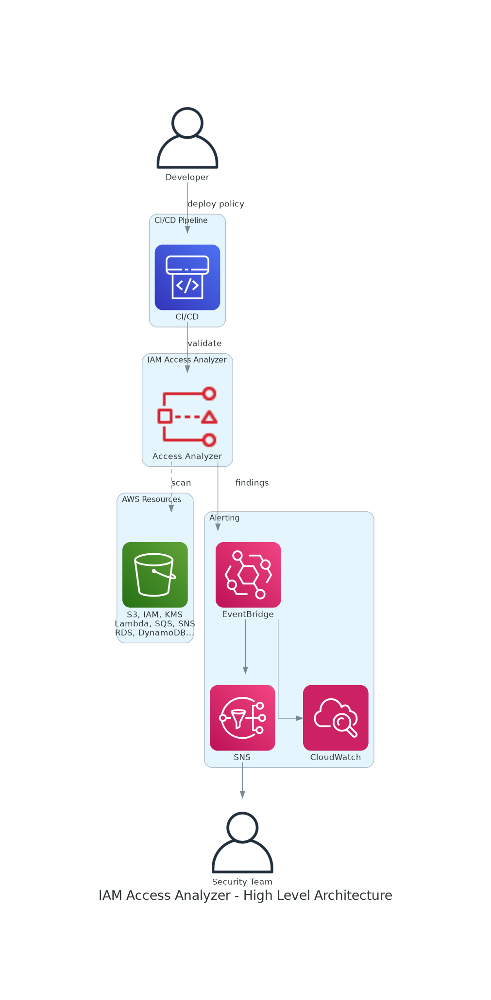

# AWS IAM Access Analyzer Solution

[](https://aws.amazon.com/iam/access-analyzer/)
[](https://python.org)
[](LICENSE)

Production-ready implementation leveraging ALL IAM Access Analyzer features for AWS security automation.

## Architecture



## Features

| Feature | API | Cost |
|---------|-----|------|
| External Access Detection | `list_findings_v2` | FREE |
| Internal Access Detection | `list_findings_v2` | $9.00/resource/month |
| Unused Access Analysis | `list_findings_v2` | $0.20/identity/month |
| Policy Validation | `validate_policy` | FREE |
| Public Access Check | `check_no_public_access` | $0.002/call |
| Access Not Granted Check | `check_access_not_granted` | $0.002/call |
| No New Access Check | `check_no_new_access` | $0.002/call |
| Access Preview | `create_access_preview` | FREE |
| Policy Generation | `start_policy_generation` | FREE |

## Supported Resources

### External Access Analysis (15 resource types)

| Category | Resources |
|----------|-----------|
| Storage | S3 Buckets, S3 Directory Buckets, EBS Snapshots, EFS |
| Compute | Lambda Functions and Layers |
| Database | RDS Snapshots, RDS Cluster Snapshots, DynamoDB Tables and Streams |
| Security | IAM Roles, KMS Keys, Secrets Manager |
| Messaging | SQS Queues, SNS Topics |
| Containers | ECR Repositories |

### Internal Access Analysis (6 resource types)
S3 Buckets, S3 Directory Buckets, RDS Snapshots, RDS Cluster Snapshots, DynamoDB Tables and Streams

## Quick Start

### Prerequisites
- AWS CLI v2 configured
- Python 3.9+
- AWS account with IAM permissions

### Deploy Infrastructure
```bash
aws cloudformation deploy \
  --template-file infrastructure/access-analyzer-setup.yaml \
  --stack-name access-analyzer-solution \
  --parameter-overrides NotificationEmail=your@email.com \
  --capabilities CAPABILITY_NAMED_IAM
```

### Run Security Scan
```bash
pip install boto3
python3 comprehensive_solution.py
```

### CI/CD Integration
```bash
python3 cicd_integration.py ./policies
```

## Project Structure

```
├── comprehensive_solution.py       # Full Python SDK wrapper
├── cicd_integration.py             # CI/CD pipeline integration
├── security_dashboard.py           # Security findings dashboard
├── infrastructure/
│   └── access-analyzer-setup.yaml  # CloudFormation template
├── .github/workflows/
│   └── policy-validation.yml       # GitHub Actions workflow
├── 01-validate-policy/             # Policy validation examples
├── 02-create-access-preview/       # Access preview examples
├── 03-no-iac/                      # Non-IaC policy scanning
├── 04-cloudformation/              # CloudFormation validation
└── 05-scps/                        # Service Control Policies
```

## Pricing Estimate

| Component | Price | Example (100 identities) |
|-----------|-------|--------------------------|
| External Access Analyzer | FREE | $0 |
| Unused Access Analyzer | $0.20/identity/month | $20/month |
| Custom Policy Checks | $0.002/call | ~$2/month |
| Total | | ~$22/month |

## Cost Estimation (2026 Pricing - Worst Case)

> **Region:** Asia Pacific (Singapore) - ap-southeast-1  
> **Last Updated:** February 2026  
> **Scenario:** Worst-case (maximum cost estimation)

### IAM Access Analyzer Pricing Reference

| Feature | Unit | Price (USD) | Notes |
|---------|------|-------------|-------|
| External Access Analyzer | per analyzer | FREE | Detects external access |
| Internal Access Analyzer | per resource/month | $9.00 | Cross-account access |
| Unused Access Analyzer | per identity/month | $0.20 | Roles, users, policies |
| Custom Policy Checks | per API call | $0.002 | check_no_public_access, etc. |
| Policy Validation | per API call | FREE | validate_policy |
| Access Preview | per preview | FREE | create_access_preview |
| Policy Generation | per generation | FREE | start_policy_generation |

### Infrastructure Costs (CloudFormation Stack)

| Service | Unit | Price (USD) |
|---------|------|-------------|
| Lambda Requests | per 1M requests | $0.20 |
| Lambda Duration | per GB-second | $0.0000166667 |
| EventBridge Rules | per rule | FREE |
| SNS Notifications | per 1M requests | $0.50 |
| SNS Email | per 1,000 emails | $2.00 |
| CloudWatch Logs | per GB ingested | $0.57 |
| CloudWatch Alarms | per alarm/month | $0.10 |
| S3 Storage | per GB/month | $0.025 |

### Worst-Case Monthly Cost Calculation

**Assumptions (Enterprise Scale):**
- 1,000 IAM identities (users + roles)
- 100 resources with Internal Access Analyzer
- 10,000 custom policy check calls/month
- 1,000 CI/CD pipeline runs/month
- Verbose logging enabled

| Component | Worst-Case Calculation | Monthly Cost |
|---------|------------------------|--------------|
| **IAM Access Analyzer** | | |
| - External Access | 1 analyzer × FREE | $0.00 |
| - Internal Access | 100 resources × $9.00 | $900.00 |
| - Unused Access | 1,000 identities × $0.20 | $200.00 |
| - Custom Policy Checks | 10,000 calls × $0.002 | $20.00 |
| - Policy Validation | Unlimited × FREE | $0.00 |
| **Infrastructure** | | |
| - Lambda Requests | 5,000 × $0.20/1M | $0.00 |
| - Lambda Duration | 10,000 GB-s × $0.0000166667 | $0.17 |
| - CloudWatch Logs | 2 GB × $0.57 | $1.14 |
| - CloudWatch Alarms | 5 × $0.10 | $0.50 |
| - SNS Notifications | 1,000 × $0.50/1M | $0.00 |
| - SNS Email | 1,000 × $2.00/1000 | $2.00 |
| - S3 Reports | 1 GB × $0.025 | $0.03 |
| | | |
| **TOTAL WORST-CASE** | | **$1,123.84** |

### Cost by Scale

| Scale | Identities | Resources (Internal) | Policy Checks | Monthly Cost | Annual Cost |
|-------|------------|---------------------|---------------|--------------|-------------|
| Startup | 50 | 0 | 500 | $11.00 | $132 |
| SMB | 100 | 10 | 1,000 | $112.00 | $1,344 |
| Medium | 500 | 50 | 5,000 | $560.00 | $6,720 |
| Large | 1,000 | 100 | 10,000 | $1,124.00 | $13,488 |
| Enterprise | 5,000 | 500 | 50,000 | $5,600.00 | $67,200 |

### Cost Breakdown (Worst-Case: 1,000 Identities)

```
Internal Access Analyzer:  $900.00  (80.1%)
Unused Access Analyzer:    $200.00  (17.8%)
Custom Policy Checks:       $20.00  ( 1.8%)
Infrastructure:              $3.84  ( 0.3%)
────────────────────────────────────────────
TOTAL:                   $1,123.84  (100%)
```

### Cost Optimization Strategies

| Strategy | Implementation | Potential Savings |
|----------|----------------|-------------------|
| Skip Internal Analyzer | Use External only (FREE) | $900/month |
| Reduce identity scope | Exclude service accounts | Up to 50% |
| Batch policy checks | Cache validation results | Up to 80% |
| Use exclusion filters | Exclude trusted accounts | Variable |
| Archive old findings | S3 lifecycle policies | ~40% storage |

### Comparison: With vs Without Internal Access Analyzer

| Configuration | Monthly Cost | Annual Cost | Use Case |
|---------------|--------------|-------------|----------|
| External Only (FREE) | $20.00 | $240 | Basic security |
| External + Unused | $220.00 | $2,640 | Compliance |
| Full (with Internal) | $1,124.00 | $13,488 | Enterprise security |

### Free Tier & Free Features

| Feature | Status | Notes |
|---------|--------|-------|
| External Access Analyzer | ✅ FREE | Always free |
| Policy Validation API | ✅ FREE | Unlimited calls |
| Access Preview | ✅ FREE | Unlimited previews |
| Policy Generation | ✅ FREE | Based on CloudTrail |
| Lambda (1M requests) | ✅ FREE | Free tier |
| CloudWatch (10 alarms) | ✅ FREE | Free tier |

### ROI Analysis

| Approach | Time/Month | Annual Cost | Notes |
|----------|------------|-------------|-------|
| Manual Security Audit | 80 hours | $48,000 | $50/hr × 80hrs × 12 |
| This Solution (Full) | 2 hours | $13,488 | Automated + review |
| **Savings** | **78 hours** | **$34,512** | **72% reduction** |

### Cost Alerts Recommendation

```bash
# Set up AWS Budget
aws budgets create-budget \
  --account-id $ACCOUNT_ID \
  --budget '{
    "BudgetName": "AccessAnalyzer-Monthly",
    "BudgetLimit": {"Amount": "500", "Unit": "USD"},
    "TimeUnit": "MONTHLY",
    "BudgetType": "COST"
  }'
```

| Alert | Threshold | Action |
|-------|-----------|--------|
| Monthly budget | $500 | Email notification |
| Forecasted | $1,000 | Email + SNS |
| Anomaly | 200% baseline | Immediate alert |

> ⚠️ **Note:** Internal Access Analyzer ($9/resource/month) is the primary cost driver.  
> 💡 **Tip:** Start with External + Unused Access only for cost-effective security.  
> 📊 Use [AWS Pricing Calculator](https://calculator.aws/#/createCalculator/IAMAccessAnalyzer) for custom estimates.  
> 📈 Prices effective February 2026. Check [AWS Pricing](https://aws.amazon.com/iam/access-analyzer/pricing/) for updates.

## Configuration Examples

### Exclude Accounts from Analysis
```python
from comprehensive_solution import AccessAnalyzerSolution

solution = AccessAnalyzerSolution()
solution.update_analyzer_exclusions(
    analyzer_name='unused-access-analyzer',
    exclude_account_ids=['111122223333'],
    exclude_tags=[{'team': 'security'}]
)
```

### CI/CD Policy Checks
```python
# Block public access
result = solution.check_no_public_access(policy, 'AWS::S3::Bucket')
if result['result'] == 'FAIL':
    sys.exit(1)

# Block dangerous actions
result = solution.check_access_not_granted(policy, ['iam:*', 'iam:PassRole'])
if result['result'] == 'FAIL':
    sys.exit(1)
```

## Documentation

| Resource | Link |
|----------|------|
| IAM Access Analyzer User Guide | [AWS Docs](https://docs.aws.amazon.com/IAM/latest/UserGuide/what-is-access-analyzer.html) |
| Supported Resource Types | [AWS Docs](https://docs.aws.amazon.com/IAM/latest/UserGuide/access-analyzer-resources.html) |
| Custom Policy Checks | [AWS Docs](https://docs.aws.amazon.com/IAM/latest/UserGuide/access-analyzer-custom-policy-checks.html) |
| API Reference | [AWS Docs](https://docs.aws.amazon.com/access-analyzer/latest/APIReference/) |
| Pricing | [AWS Pricing](https://aws.amazon.com/iam/access-analyzer/pricing/) |

## Related AWS Blog Posts

- [Customize scope of unused access analysis](https://aws.amazon.com/blogs/security/customize-the-scope-of-iam-access-analyzer-unused-access-analysis/) (Jan 2025)
- [Refine unused access using recommendations](https://aws.amazon.com/blogs/security/refine-unused-access-using-iam-access-analyzer-recommendations) (Sep 2024)

## Contributing

Contributions welcome! See [CONTRIBUTING.md](CONTRIBUTING.md) for guidelines.

## License

This project is licensed under the MIT-0 License. See [LICENSE](LICENSE) for details.

## Author

**Kha Van** - [GitHub](https://github.com/vanhoangkha)
