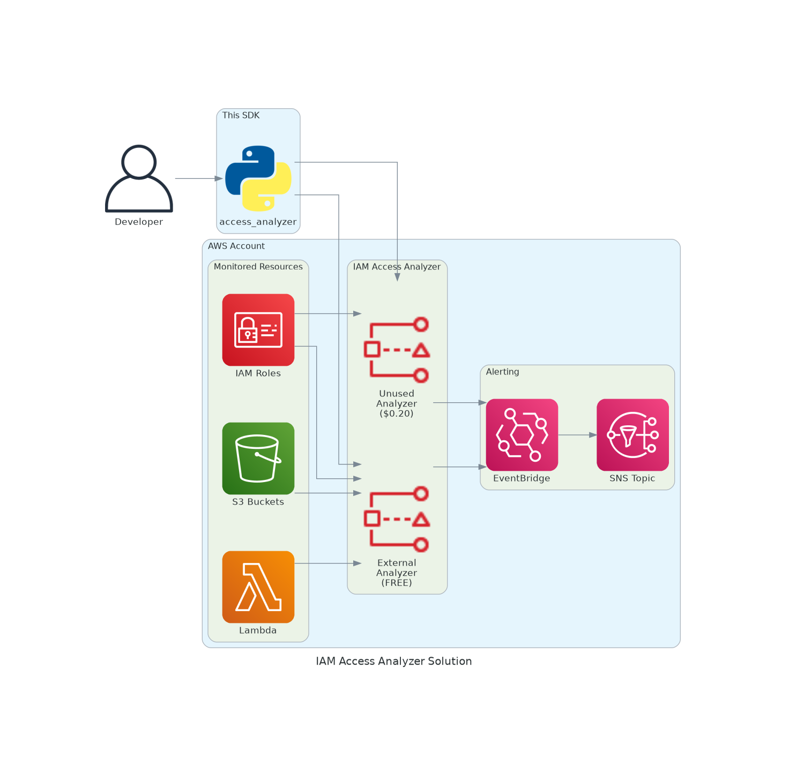

# AWS IAM Access Analyzer Solution

[](https://aws.amazon.com/iam/access-analyzer/)
[](https://python.org)
[](LICENSE)
[](https://github.com/vanhoangkha/aws-iam-access-analyzer-solution/actions)
[](https://github.com/psf/black)

> Complete Python SDK implementing all 37 IAM Access Analyzer APIs for AWS security automation.

## 🎯 Overview

AWS IAM Access Analyzer helps identify resources in your organization and accounts that are shared with external entities. This solution provides a comprehensive Python SDK that wraps all 37 Access Analyzer APIs, making it easy to integrate security scanning into your CI/CD pipelines and automation workflows.

### Key Features

- ✅ **Complete API Coverage** - All 37 IAM Access Analyzer APIs implemented
- 🔒 **Security Scanning** - Detect external access, unused permissions, and policy issues
- 🚀 **CI/CD Integration** - Built-in policy validation for pipelines
- 📊 **Security Dashboard** - Visual reporting of findings
- 🏗️ **Infrastructure as Code** - CloudFormation templates included

## 📐 Architecture



| Diagram | Description |
|---------|-------------|
| [CI/CD Pipeline](docs/cicd-pipeline.png) | Policy validation in CI/CD |
| [Monitoring Flow](docs/monitoring-flow.png) | Security alerting flow |
| [SDK Components](docs/sdk-components.png) | Package structure |
| [Full Documentation](docs/ARCHITECTURE.md) | Complete architecture docs |

## 🚀 Quick Start

### Installation

```bash
# Install from source
pip install -e .

# Or install with dev dependencies
pip install -e ".[dev]"
```

### Basic Usage

```python
from access_analyzer import AccessAnalyzerClient

client = AccessAnalyzerClient()

# Run full security scan
results = client.full_scan()
print(f"External findings: {results['summary']['external_count']}")
print(f"Unused findings: {results['summary']['unused_count']}")

# Validate a policy
findings = client.validate_policy({
    "Version": "2012-10-17",
    "Statement": [{"Effect": "Allow", "Action": "s3:*", "Resource": "*"}]
})

# Check for public access
result = client.check_no_public_access(policy, 'AWS::S3::Bucket')
```

### CLI Usage

```bash
# Run security scan
access-analyzer scan

# Validate policies in directory
access-analyzer validate ./policies

# Show security dashboard
access-analyzer dashboard

# Export report to JSON
access-analyzer dashboard --export report.json
```

## 📁 Project Structure

```
.
├── src/access_analyzer/
│   ├── __init__.py          # Package exports
│   ├── __main__.py          # CLI entry point
│   ├── client.py            # AccessAnalyzerClient (37 APIs)
│   ├── cicd.py              # PolicyValidator for CI/CD
│   └── dashboard.py         # SecurityDashboard
├── infrastructure/
│   └── access-analyzer-setup.yaml
├── examples/
│   ├── policy-validation/   # Policy validation examples
│   ├── access-preview/      # Access preview examples
│   ├── scp-validation/      # SCP validation examples
│   ├── service-scanning/    # Service-specific scanning
│   ├── cloudformation/      # CloudFormation examples
│   ├── cdk/                 # CDK examples
│   └── sample-policies/     # Sample IAM policies
├── tests/                   # Unit tests
├── docs/                    # Documentation
└── pyproject.toml           # Package configuration
```

## 📚 API Reference

### Analyzer Management (5 APIs)
| Method | Description |
|--------|-------------|
| `create_analyzer` | Create external, internal, or unused access analyzer |
| `delete_analyzer` | Delete an analyzer |
| `get_analyzer` | Get analyzer details |
| `list_analyzers` | List all analyzers |
| `update_analyzer` | Update analyzer configuration |

### Findings (6 APIs)
| Method | Description |
|--------|-------------|
| `list_findings` | List findings (v1) |
| `list_findings_v2` | List findings with enhanced details |
| `get_finding` | Get finding details (v1) |
| `get_finding_v2` | Get finding details (v2) |
| `update_findings` | Archive or resolve findings |
| `get_findings_statistics` | Get aggregated statistics |

### Archive Rules (6 APIs)
| Method | Description |
|--------|-------------|
| `create_archive_rule` | Create auto-archive rule |
| `delete_archive_rule` | Delete archive rule |
| `get_archive_rule` | Get archive rule details |
| `list_archive_rules` | List all archive rules |
| `update_archive_rule` | Update archive rule |
| `apply_archive_rule` | Apply rule to existing findings |

### Policy Validation (4 APIs)
| Method | Description | Cost |
|--------|-------------|------|
| `validate_policy` | Validate against best practices | FREE |
| `check_no_public_access` | Check for public access | $0.002/call |
| `check_access_not_granted` | Check actions not granted | $0.002/call |
| `check_no_new_access` | Compare policies | $0.002/call |

### Access Preview (4 APIs)
| Method | Description |
|--------|-------------|
| `create_access_preview` | Preview policy changes (FREE) |
| `get_access_preview` | Get preview status |
| `list_access_previews` | List all previews |
| `list_access_preview_findings` | Get preview findings |

### Policy Generation (4 APIs)
| Method | Description |
|--------|-------------|
| `start_policy_generation` | Generate from CloudTrail (FREE) |
| `get_generated_policy` | Get generated policy |
| `cancel_policy_generation` | Cancel generation job |
| `list_policy_generations` | List generation jobs |

### Resources (3 APIs)
| Method | Description |
|--------|-------------|
| `get_analyzed_resource` | Get resource details |
| `list_analyzed_resources` | List analyzed resources |
| `start_resource_scan` | Trigger immediate scan |

### Recommendations (2 APIs)
| Method | Description |
|--------|-------------|
| `generate_finding_recommendation` | Generate recommendations |
| `get_finding_recommendation` | Get recommendations |

### Tags (3 APIs)
| Method | Description |
|--------|-------------|
| `tag_resource` | Add tags to analyzer |
| `untag_resource` | Remove tags |
| `list_tags_for_resource` | List tags |

## 💰 Pricing

| Feature | Cost |
|---------|------|
| External Access Analyzer | FREE |
| Unused Access Analyzer | $0.20/identity/month |
| Internal Access Analyzer | $9.00/resource/month |
| Custom Policy Checks | $0.002/call |
| Policy Validation | FREE |
| Access Preview | FREE |
| Policy Generation | FREE |

## 🏗️ Deploy Infrastructure

```bash
aws cloudformation deploy \
  --template-file infrastructure/access-analyzer-setup.yaml \
  --stack-name access-analyzer \
  --parameter-overrides NotificationEmail=your@email.com \
  --capabilities CAPABILITY_NAMED_IAM
```

## 🧪 Development

```bash
# Clone repository
git clone https://github.com/vanhoangkha/aws-iam-access-analyzer-solution.git
cd aws-iam-access-analyzer-solution

# Install dev dependencies
pip install -e ".[dev]"

# Run tests
pytest

# Format code
black src tests
isort src tests

# Type checking
mypy src
```

## 📖 Documentation

- [IAM Access Analyzer User Guide](https://docs.aws.amazon.com/IAM/latest/UserGuide/what-is-access-analyzer.html)
- [API Reference](https://docs.aws.amazon.com/access-analyzer/latest/APIReference/API_Operations.html)
- [Pricing](https://aws.amazon.com/iam/access-analyzer/pricing/)

## 🤝 Contributing

Contributions are welcome! Please read our [Contributing Guide](CONTRIBUTING.md) for details.

## 📄 License

This project is licensed under the MIT-0 License - see the [LICENSE](LICENSE) file for details.

## 👤 Author

**Kha Van**
- Email: khavan.work@gmail.com
- GitHub: [@vanhoangkha](https://github.com/vanhoangkha)

---

⭐ If you find this project useful, please consider giving it a star!
