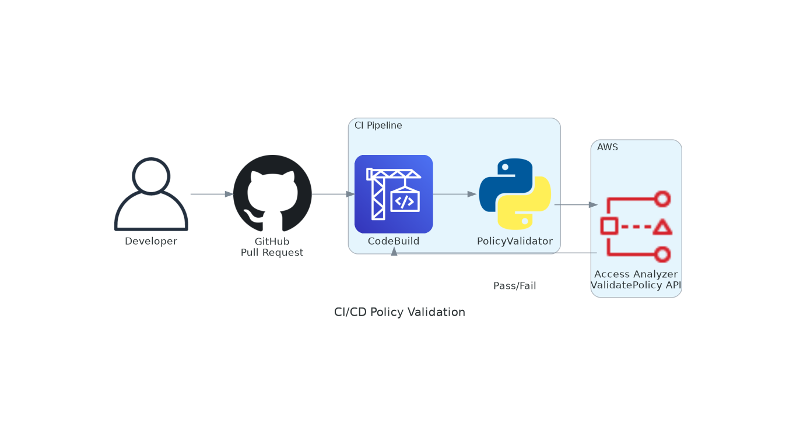
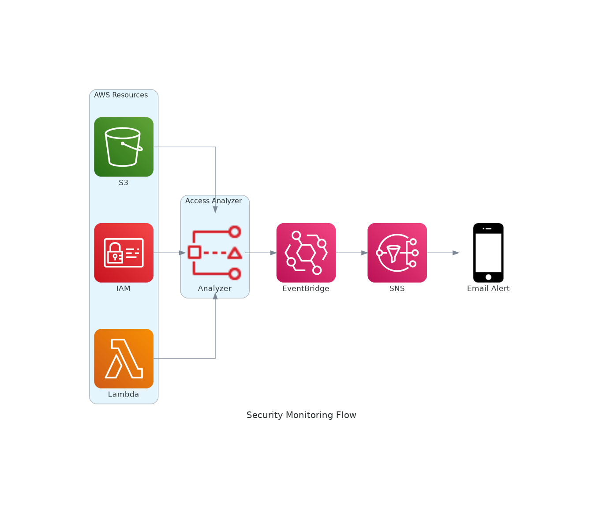
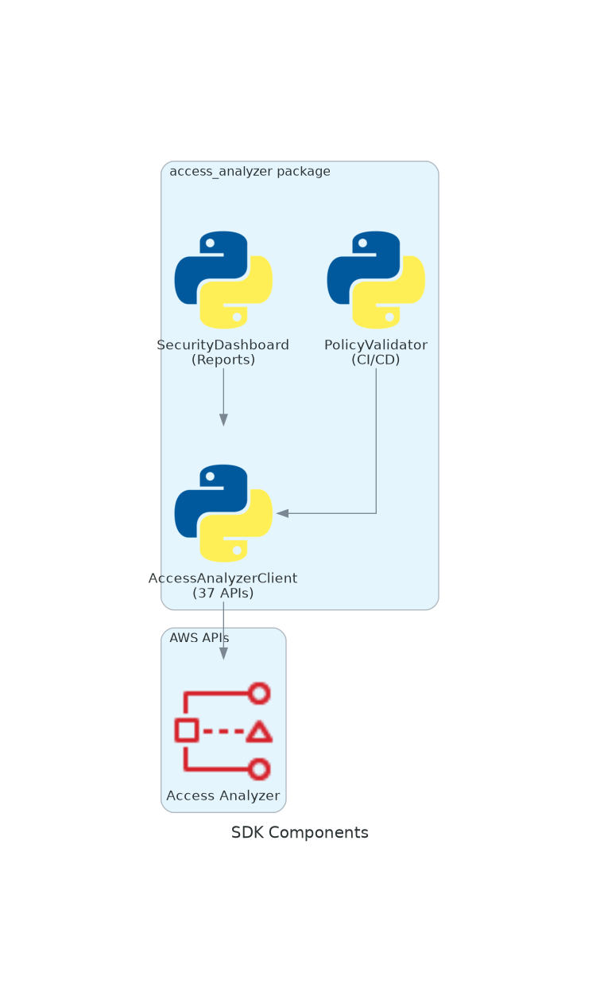

# Architecture

## Solution Overview


## CI/CD Pipeline Integration



## Security Monitoring Flow



## SDK Components



## Components

### 1. AccessAnalyzerClient (client.py)

Core SDK implementing all 37 AWS APIs:

```
AccessAnalyzerClient
├── Analyzer Management (5 APIs)
│   ├── create_analyzer()
│   ├── delete_analyzer()
│   ├── get_analyzer()
│   ├── list_analyzers()
│   └── update_analyzer()
│
├── Findings (6 APIs)
│   ├── list_findings() / list_findings_v2()
│   ├── get_finding() / get_finding_v2()
│   ├── update_findings()
│   └── get_findings_statistics()
│
├── Archive Rules (6 APIs)
│   ├── create_archive_rule()
│   ├── delete_archive_rule()
│   ├── get_archive_rule()
│   ├── list_archive_rules()
│   ├── update_archive_rule()
│   └── apply_archive_rule()
│
├── Policy Validation (4 APIs) - FREE
│   ├── validate_policy()
│   ├── check_no_public_access()
│   ├── check_access_not_granted()
│   └── check_no_new_access()
│
├── Access Preview (4 APIs) - FREE
│   ├── create_access_preview()
│   ├── get_access_preview()
│   ├── list_access_previews()
│   └── list_access_preview_findings()
│
├── Policy Generation (4 APIs) - FREE
│   ├── start_policy_generation()
│   ├── get_generated_policy()
│   ├── cancel_policy_generation()
│   └── list_policy_generations()
│
├── Resources (3 APIs)
│   ├── get_analyzed_resource()
│   ├── list_analyzed_resources()
│   └── start_resource_scan()
│
├── Recommendations (2 APIs)
│   ├── generate_finding_recommendation()
│   └── get_finding_recommendation()
│
└── Tags (3 APIs)
    ├── tag_resource()
    ├── untag_resource()
    └── list_tags_for_resource()
```

### 2. PolicyValidator (cicd.py)

CI/CD integration for policy validation:

```
PolicyValidator
├── validate_policy()           # Validate single policy
├── check_no_public_access()    # Block public access
├── check_no_privilege_escalation()  # Detect dangerous permissions
└── validate_directory()        # Batch validate policies
```

### 3. SecurityDashboard (dashboard.py)

Security reporting and monitoring:

```
SecurityDashboard
├── get_analyzers()      # List active analyzers
├── generate_report()    # Generate security report
└── export_json()        # Export to JSON file
```

## Data Flow

### CI/CD Pipeline Integration

```
+-------------+     +----------------+     +------------------+
|   Git Push  |---->|  CI Pipeline   |---->|  PolicyValidator |
+-------------+     +----------------+     +------------------+
                           |                       |
                           v                       v
                    +----------------+     +------------------+
                    |  Pass/Fail     |<----|  Access Analyzer |
                    |  Gate          |     |  API             |
                    +----------------+     +------------------+
```

### Security Monitoring

```
+------------------+     +------------------+     +------------------+
|  Access Analyzer |---->|  EventBridge     |---->|  SNS Topic       |
|  (Findings)      |     |  Rule            |     |  (Alerts)        |
+------------------+     +------------------+     +------------------+
                                                         |
                                                         v
                                                  +------------------+
                                                  |  Email/Slack     |
                                                  +------------------+
```

## Infrastructure (CloudFormation)

```yaml
Resources:
  ExternalAccessAnalyzer    # FREE - Detects public/cross-account access
  UnusedAccessAnalyzer      # $0.20/entity - Detects unused permissions
  SNSTopic                  # KMS encrypted alerts
  EventBridgeRule           # Auto-notify on findings
  BudgetAlert               # Cost monitoring ($10 threshold)
```

## Cost Model

| Component | Pricing | Notes |
|-----------|---------|-------|
| External Access Analyzer | FREE | Always enable |
| Unused Access Analyzer | $0.20/IAM role or user/month | Optional |
| Policy Validation | FREE | Unlimited |
| Custom Policy Checks | $0.002/API call | Use sparingly |
| Access Preview | FREE | Unlimited |

## Security

- No hardcoded credentials - uses IAM roles
- All SNS topics encrypted with KMS
- Least privilege IAM policies
- Input validation on all file operations
- Dependency versions pinned
